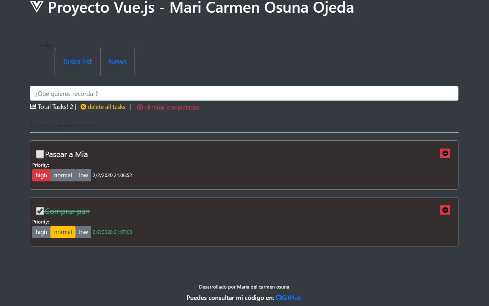

<h1>Project Vue.js
</h1>

<h5 style="color: #5e9ca0;">We must have node installed. (we check the version with node -v)</h5>

  &nbsp;

It is intended to develop an application to manage reminders

&nbsp; &nbsp; &nbsp; &nbsp; &nbsp; &nbsp; &nbsp;

<strong>&nbsp;</strong>

